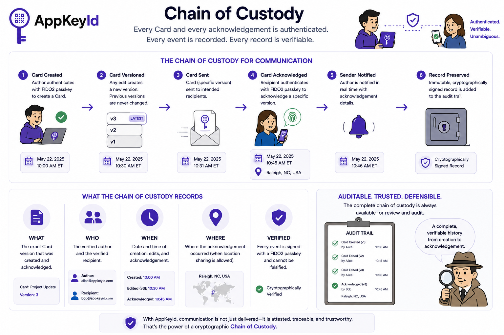

# Chain of Custody

A first fundamental principle of AppKeyId is that communication should be as auditable as any financial 
transaction or legal document. To achieve this, every stage in the life of a Card is cryptographically 
authenticated, creating a verifiable **chain of custody** from author to recipient.

The chain begins when an author creates a Card. Before the Card is committed to the system, 
the author authenticates using a FIDO2 passkey. This cryptographically binds the Card to the 
verified identity of its creator and establishes precisely who authored the communication and 
when it was created.

## Card Versioning

Unlike traditional messaging systems, Cards are immutable once published. If the author changes 
the title, content, attachments, recipients, or any other significant property, AppKeyId creates 
a new version of the Card rather than modifying the existing one. Each version has its own identity 
and its own authenticated history. Recipients never acknowledge a vague or changing document—they 
acknowledge a specific version of a specific Card. This eliminates ambiguity over what information 
was presented at the moment of acknowledgement.

## Tracking Authorship and Acknowledgements

When a recipient acknowledges a Card, they must authenticate using their own FIDO2 passkey. 
The acknowledgement is cryptographically signed and permanently associated with the exact version 
of the Card that was consumed. The acknowledgement records the verified recipient, the date and 
time of acknowledgement, and, where permitted by the user and application, the geographic location 
from which the acknowledgement occurred. The result is an authenticated record of communication 
that cannot later be disputed without invalidating the underlying digital signatures.

Together, authenticated authorship and authenticated acknowledgement form a complete chain of custody. 
For every communication, AppKeyId can answer the fundamental questions:

* **What** was communicated? (The exact version of the Card.)
* **Who** authored it?
* **Who** acknowledged it?
* **When** was it created and acknowledged?
* **Where** was the acknowledgement made? (When location is available.)

This chain of custody is continuously preserved as Cards evolve through new versions. 
Every revision extends the communication history rather than replacing it, providing a 
complete chronological record of how the communication changed over time and who acknowledged 
each version.

## Auditable Chain of Custody

Perhaps most importantly, the entire chain of custody is **auditable**. Organizations can review 
the complete lifecycle of a communication—from creation through every revision and every 
cknowledgement—using cryptographically verifiable records rather than relying on application 
logs or user testimony. Because every critical event is authenticated with FIDO2 passkeys, 
the audit trail provides substantially stronger evidence than conventional email headers, 
messaging logs, or server timestamps.

In regulated industries, legal proceedings, compliance reporting, project governance, healthcare, 
education, financial services, and enterprise workflows, this auditable chain of custody provides 
confidence that communications occurred exactly as recorded. It transforms digital communication 
from a best-effort exchange of messages into a verifiable record of authenticated human interaction.