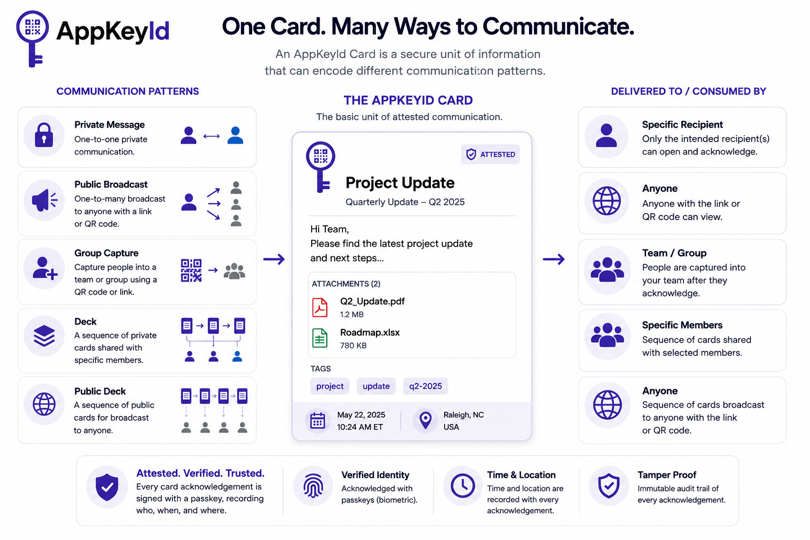

# What is a Card?

A Card is the basic unit of communication in AppKeyId. It is similar to a lightweight email, memo, 
or secure note. A Card can contain formatted Markdown text and optional file attachments.

## Cards are the building blocks for communication

But a Card is more than a message.

A Card is an **attested communication** object. It can be acknowledged by a recipient only 
after the recipient authenticates with their AppKeyId passkey.

This makes the Card different from an ordinary email or shared link. 
The value of the Card is not just its content. The value is the verified acknowledgment event attached to it.

A Card may include:

- Markdown text
- Attachments
- Sender identity
- Recipient rules
- Contact rules
- Team rules
- QR publication rules
- Acknowledgment history

## Authenticated QR Codes/Links

AppKeyId can also publish a Card as an authenticated QR code. Unlike an ordinary QR code, 
which simply opens a public web page, an AppKeyId QR code can initiate a 
passkey-authenticated acknowledgment flow.

This turns QR codes into verified action points.

A user scans the QR code (or clicks on a link), authenticates with their AppKeyId passkey, 
and acknowledges the Card. The sender or publisher receives a record of who acknowledged 
the Card, when, and where.

## AppKeyId Card Types

The Card is the fundamental building block of AppKeyId. Every card represents a unit of information 
that can be securely shared, acknowledged, and authenticated using FIDO2 passkeys. 
While every card shares the same security and identity model, different card types are designed 
for different communication patterns.

### Private Message Cards

Private Message Cards are the secure equivalent of email or direct messaging. 
They are sent to one or more specific recipients, who authenticate with their passkey before 
acknowledging the message. This provides the sender with cryptographic proof of who read the 
message and when. Typical uses include confidential business communications, legal notices, 
customer communications, and any situation where proof of acknowledgement matters.

### Public Broadcast Cards

Public Broadcast Cards are intended for information shared with a broad audience. 
hey can be distributed through a public link or QR code while still allowing optional 
authentication and acknowledgement. They are ideal for announcements, product information, 
documentation, marketing campaigns, and other publicly accessible content.

### Group Capture Cards

Group Capture Cards allow organizations to add authenticated users to a Team simply by scanning a 
QR code or following a link. Rather than collecting only an email address, the organization establishes a 
trusted identity relationship that can immediately be used for future communications. 
Common examples include event registration, employee onboarding, club memberships, and customer communities.

### Decks

A Deck is an ordered collection of Private Message Cards presented as a single experience. 
Decks are useful whenever information is delivered in stages, such as employee onboarding, 
training courses, project documentation, or multi-step business processes.

### Public Decks

Public Decks organize a sequence of Public Broadcast Cards behind a single public link or QR code. 
They provide an excellent way to publish documentation, tutorials, product guides, 
museum tours, or educational content while allowing individual cards to be updated over time.

## Future Card Types

The AppKeyId card architecture is designed to support additional application-specific card types without 
changing the underlying platform. Planned card types include Vote Cards for authenticated 
private voting, Poll Cards for public surveys, Event Ticket Cards for secure admission to 
events, and Authentication Action Cards that authorize actions such as unlocking doors, 
controlling IoT devices, logging into systems, or approving sensitive operations.

Although each card type serves a different purpose, they all share the same foundation: 
verified identities, passkey authentication, cryptographic proof, real-time notifications, 
and a complete audit trail. This common architecture allows AppKeyId to unify secure communication, 
authenticated workflows, and trusted digital interactions within a single platform.