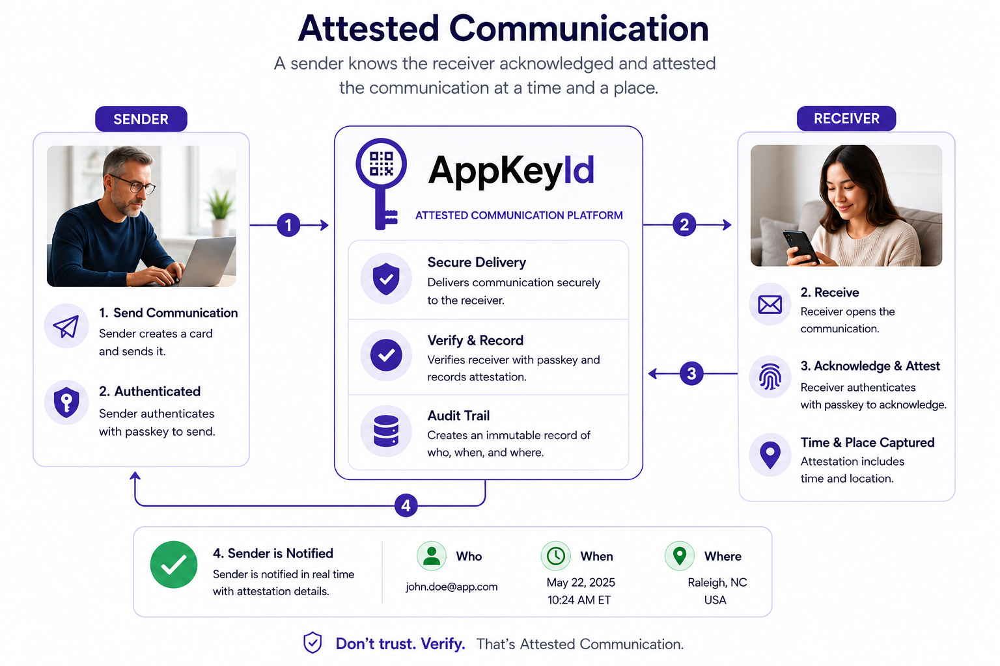

# What is Attested Communication

Attested communication means that a communication event is not merely sent, opened, or clicked. 
It is acknowledged by a cryptographically verified user identity.



## AppKeyId Attestation flow

The flow is simple:

```
  Author 
→ Card 
→ Contact or QR Recipient 
→ Passkey Verification 
→ Acknowledgment 
→ Sender Alert
```

When a recipient receives a Card through email, a direct AppKeyId connection, or QR code, 
they are prompted to acknowledge it. To do so, they must authenticate using their AppKeyId passkey. 
The device or hardware authenticator performs local user verification. 
AppKeyId validates the resulting cryptographic response using the public key associated with that user.

Once the acknowledgment succeeds, AppKeyId records an acknowledgment event containing:

- The identity of the acknowledging user
- The Card that was acknowledged
- The timestamp of acknowledgment
- Approximate location or contextual metadata
- Verification status
- The passkey-backed identity used for the acknowledgment

The sender is then alerted.

This is fundamentally different from an email return receipt. 
A return receipt may indicate that a message was opened. AppKeyId indicates 
that a passkey-backed identity acknowledged the communication.