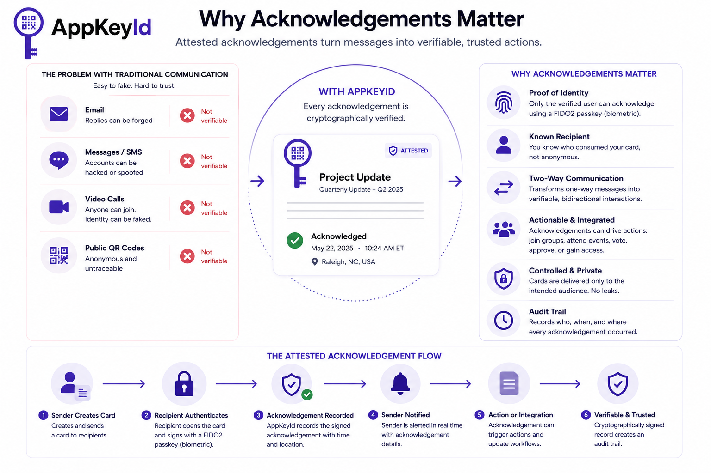

# Why Acknowledgements Matter

The foundation of attested communication is the acknowledgement. A message has little value if the 
sender cannot prove who actually received it, whether it was understood, or even whether it was 
opened by the intended recipient. Traditional communication systems—including email, SMS, 
instant messaging, and video conferencing—provide only weak evidence. An email reply can be forged, 
a messaging account can be compromised, and a video call participant can increasingly be imitated 
using AI-generated voice and video. None of these systems provide strong cryptographic proof that 
a specific individual acknowledged a specific communication.

## Cryptographically Verifiable

AppKeyId changes this model by making acknowledgement a cryptographically verifiable event. 
To acknowledge a Card, the recipient must authenticate using a FIDO2 passkey. 
In most cases, this requires biometric verification such as Face ID, Touch ID, or the device’s 
fingerprint or facial recognition system. The resulting digital signature proves that the 
acknowledgement originated from the recipient’s registered passkey and not simply from 
someone who had access to an email account or messaging application.

No authentication system is absolutely perfect. For example, a stolen hardware security key that 
is not PIN protected could theoretically be misused. However, such attacks are significantly more 
difficult than compromising an email account or sending a fraudulent text message. The confidence 
provided by passkey authentication is orders of magnitude higher than traditional communication 
methods, making acknowledgements substantially more trustworthy.

## Two-Way Communication

An acknowledgement is more than a receipt—it establishes identity. Unlike scanning an anonymous 
restaurant QR code, an AppKeyId acknowledgement identifies the verified user who consumed the 
Card. Because the user’s identity is known, the acknowledgement itself becomes an authenticated 
transaction that can carry useful application data. A single acknowledgement can simultaneously 
confirm receipt while allowing the user to join a team, register attendance at an event, cast 
a vote, approve a document, request access to a protected resource, or trigger any number of 
authenticated business workflows. Communication becomes an action rather than simply the exchange 
of information.

Acknowledgements also transform communication from a one-way broadcast into a two-way, 
authenticated conversation. The sender no longer wonders whether the message reached the 
right person or whether the recipient actually acted upon it. Every acknowledgement 
creates a verifiable chain of custody that records who acknowledged the Card, when they 
acknowledged it, and, if permitted by the user and application, where the acknowledgement 
occurred. This audit trail is invaluable for compliance, regulated industries, project management, 
legal notifications, healthcare, education, and any workflow that depends on accountability.

## Provides User Access Control to Communication

Finally, acknowledgements enable precise control over who can consume information. 
Because every recipient is authenticated before a Card is opened or acknowledged, 
AppKeyId can enforce distribution policies with cryptographic certainty. A Card can be 
limited to a single individual, a defined team, members of a particular organization, 
or any other authorized audience. Unauthorized users simply cannot consume or acknowledge 
the communication. This greatly reduces accidental disclosure, unauthorized forwarding, 
and information leakage while giving senders confidence that sensitive information remains 
within its intended audience.

In the AI era, where convincing impersonation has become commonplace, delivery is no 
longer enough. What matters is knowing who acknowledged the communication, when they 
acknowledged it, and having cryptographic proof that the acknowledgement can be trusted. 
That is the foundation of Attested Communication.