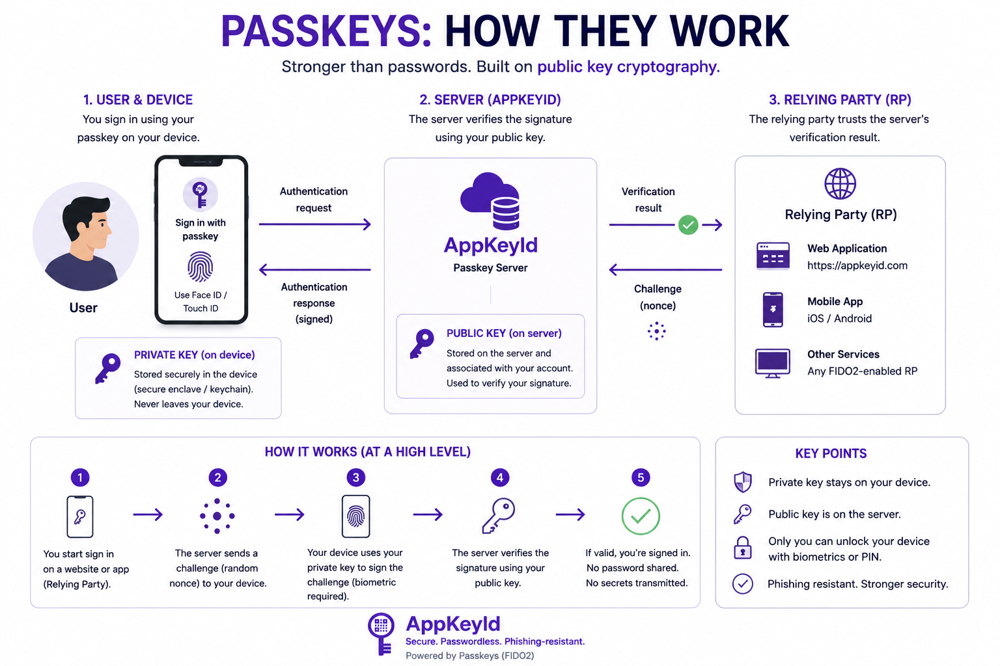

# Passkeys Explained

The emergence of FIDO2 passkeys changes what is possible.

Passkeys use public-key cryptography instead of shared passwords. When a user creates a passkey for a service,
a public-private key pair is generated. The public key is stored by the service. 
The private key remains under the user's control through the device, operating system, 
passkey provider, or hardware authenticator.

## Passkeys and biometric verification

For users, this typically means authenticating with Face ID, Touch ID, fingerprint recognition, 
a device PIN, or another local device verification method.

This is the critical shift: modern devices can now perform strong cryptographic authentication through 
familiar biometric user experiences. The user does not need to remember a password. 
The service does not need to store a password. The biometric data is not sent to the service.

In practical terms, billions of modern phones and computers are now capable of participating in secure, 
browser-based identity verification.

Passkeys may be stored on:

- A smartphone
- A laptop or desktop computer
- An operating-system passkey manager
- A secure cloud passkey provider
- A physical hardware security key

For higher-security use cases, passkeys can also be stored on dedicated hardware authenticator devices 
from providers such as **Yubico, Thales, or FEITIAN.**

This flexibility allows AppKeyId to serve both ordinary consumer users and higher-security 
enterprise users. A casual user may authenticate with Face ID or fingerprint recognition on a phone. 
A business, government, or high-risk user may require a device-bound hardware security key.

In both cases, the important principle is the same:

**The private key is not stored by AppKeyId, and the acknowledgment requires possession 
or control of the user's passkey.**