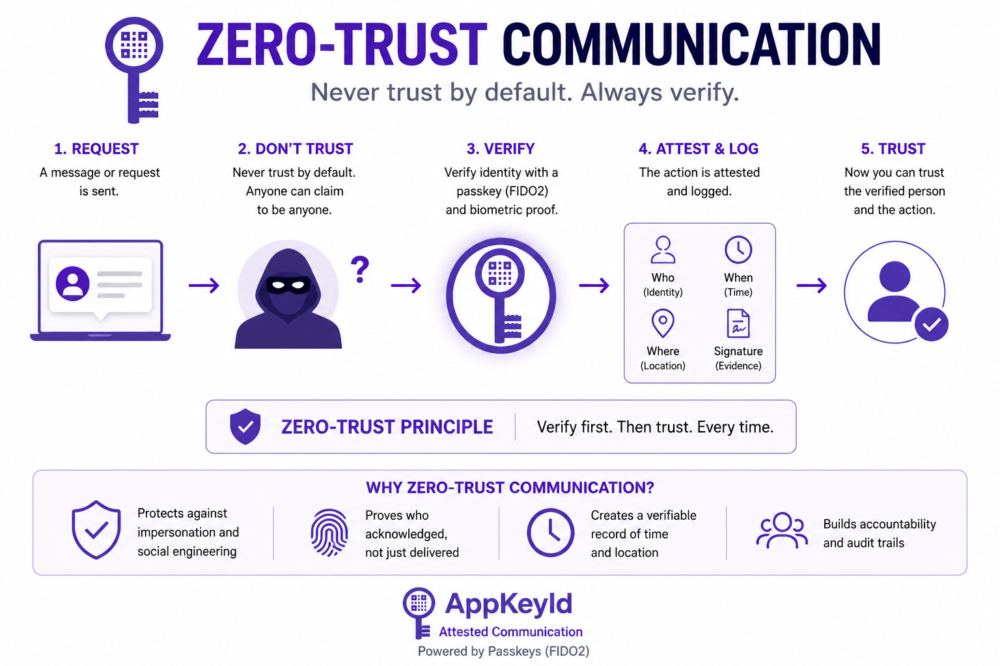

# Zero Trust Identity

AppKeyId applies Zero Trust principles to digital communication.

The central principle of Zero Trust security is simple:

**Never trust by default. Always verify.**

Traditional communication systems often assume trust based on weak identity signals: an email address, 
a phone number, a profile image, a familiar writing style, or a known account. 
AppKeyId rejects that assumption.

In the AppKeyId model, a communication is not trusted merely because:

- It came from a familiar email address
- It appeared inside an existing account
- It contained a familiar writing style
- It included a recognizable profile image
- It was accessed through a link
- It was opened from an email inbox
- It was scanned through a QR code

Instead, AppKeyId requires passkey-backed verification before a sensitive 
communication or action is acknowledged.

This transforms communication from a trust-based interaction into a verification-based interaction.

A Card acknowledgment is not accepted simply because a user clicked a link, opened an email, 
scanned a QR code, or accessed an inbox. The user must authenticate with a FIDO2/WebAuthn 
passkey before the acknowledgment is recorded.

This is Zero Trust communication for the AI impersonation era.