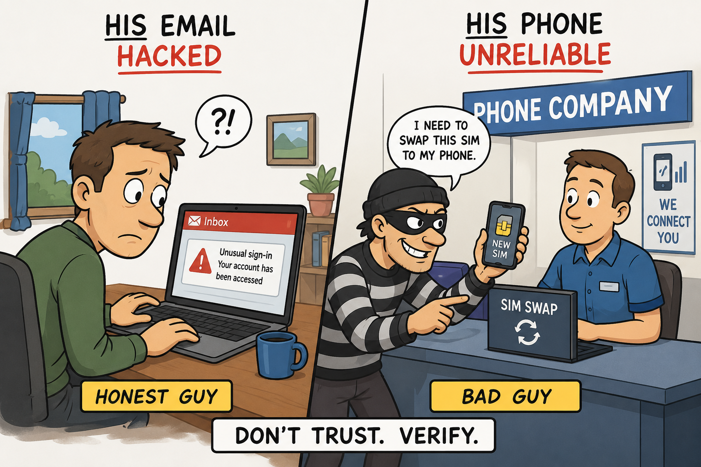

# Why Email and Messaging Aren't Enough

Passwords were never designed for the world we now inhabit. They can be stolen, phished, reused, 
guessed, leaked, or socially engineered out of users. Even traditional two-factor authentication 
can be vulnerable when users are tricked into approving login attempts or handing over one-time codes.

A particularly weak form of two-factor authentication is SMS-based 2FA.

SMS-based 2FA depends on control of a phone number, and phone numbers are not strong identity anchors. 
They can be compromised through SIM swapping, carrier account manipulation, social engineering, 
insider abuse, or weak operational processes at mobile providers.

In practical terms, phone-based 2FA is often only as strong as the least secure process - or 
least trustworthy employee - inside the mobile carrier ecosystem.

If an attacker can convince a mobile carrier to transfer a victim's number to a new SIM card, 
the attacker may receive the victim's SMS authentication codes. 
This means that a supposedly secure account can become vulnerable through a third party 
that the user does not control.

Ordinary messaging systems suffer from a related weakness. 
They may deliver a message, but they usually cannot prove that the intended human recipient 
personally acknowledged it.

A conventional email receipt might show that an email was opened. A link-tracking system might show 
that a link was clicked. A QR code might show that a web page was accessed. 
But these signals do not reliably answer the deeper identity question:

## Who actually performed the action?

- Was it the intended recipient?
- Was it someone with access to the mailbox?
- Was it a forwarded message?
- Was it a compromised account?
- Was it a SIM-swapped phone number?
- Was it an attacker using an AI-generated impersonation?
- Was it an automated bot or crawler?

AppKeyId addresses this gap by requiring passkey-based identity verification before an acknowledgment
is accepted.