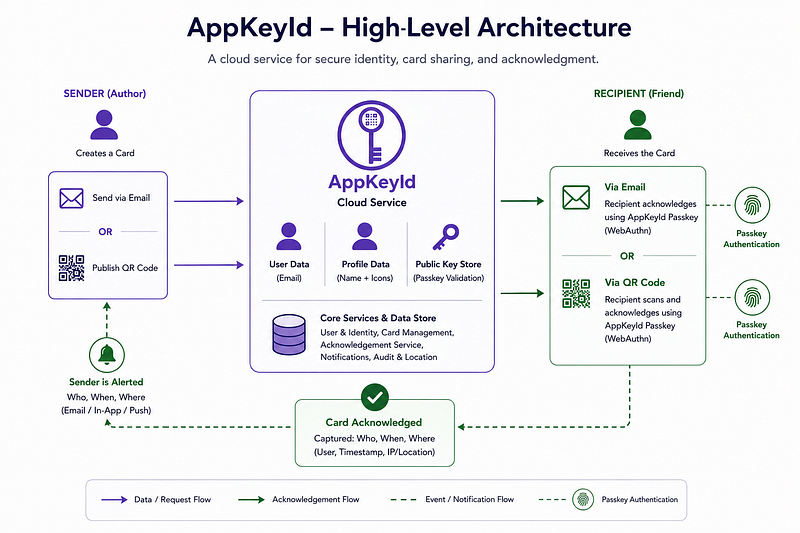

# AppKeyId is the solution

## What is AppKeyId?

AppKeyId is a passkey-verified communication portal built around **attested identity, attested 
communication, and attested actions.**

At its core, AppKeyId answers a simple but increasingly important question:

**How do you know that the person acknowledging a communication is actually the intended recipient?**

AppKeyId combines FIDO2/WebAuthn passkey authentication with a lightweight cloud-based communication system. 
Users create an AppKeyId account associated with a verified email handle. 
That email handle can be verified through a six-digit code sent to the user's email address 
or through social login providers such as Apple or Google.

Once the user's email identity is established, AppKeyId creates a FIDO2 passkey for future authentication. 
That passkey is associated with the user's AppKeyId identity. Future logins and acknowledgments 
are performed through local device verification, such as Face ID, fingerprint recognition, device PIN, 
or hardware security key authentication.

AppKeyId stores the user's verified identity handle, profile information, public passkey data, 
contact relationships, team memberships, Card content, Card distribution rules, 
and acknowledgment events.

AppKeyId does **not** store the user's private passkey. 
The private key remains on the user's device, passkey provider, or hardware security key.

AppKeyId also does **not** store the user's biometric data. Biometric verification occurs 
locally on the user's device or authenticator.

The result is a cloud service that allows communication to be linked to cryptographically verified human identity.