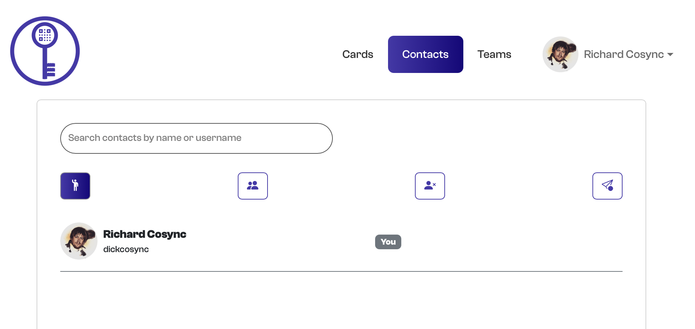
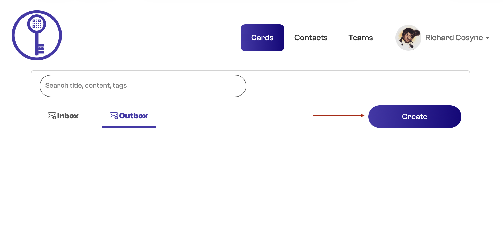
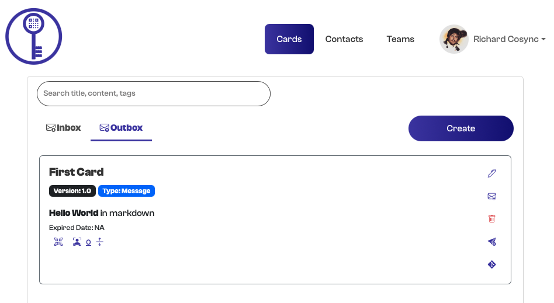
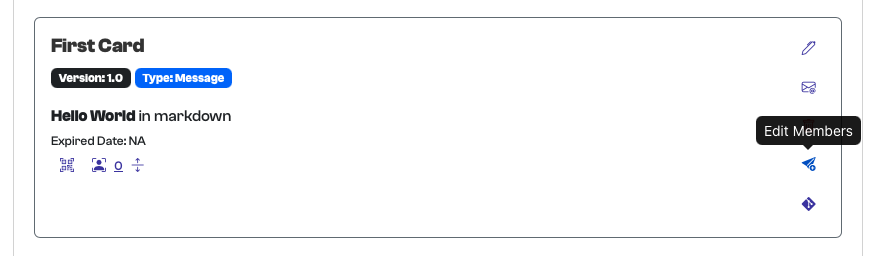
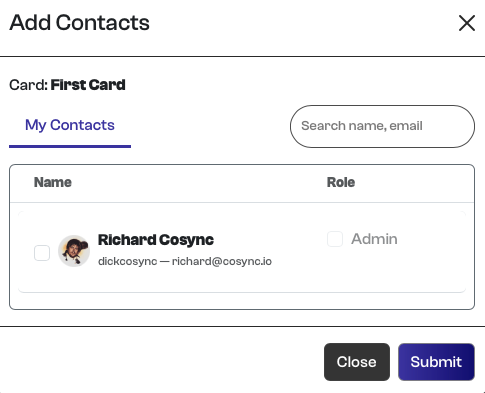
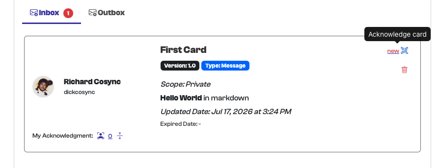
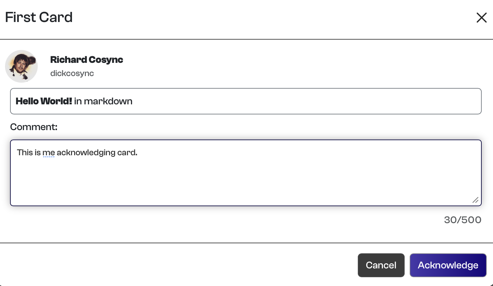
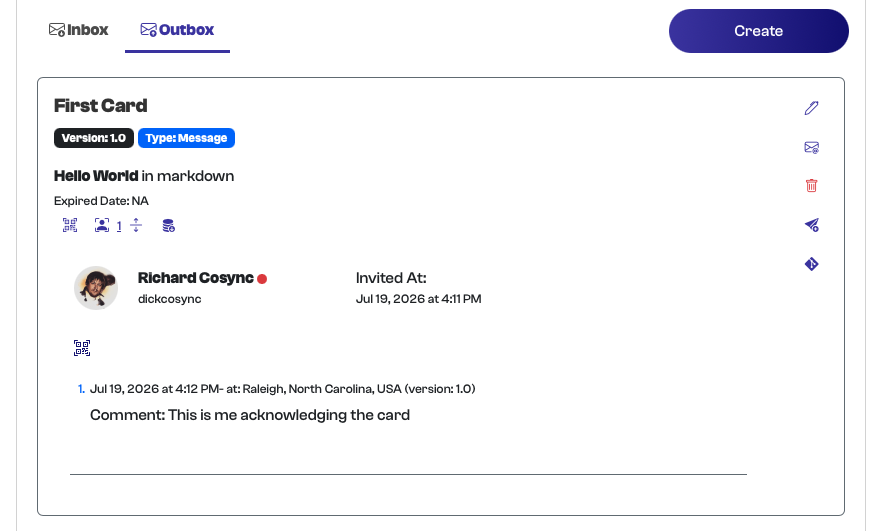

# Creating Your First Card

Now that your AppKeyId account is ready, you can begin using it to share and acknowledge information.

In this tutorial, you will:

1. Create your first card.

2. Share the card with yourself.

3. Receive the card in your AppKeyId inbox and email inbox.

4. Acknowledge the card using your passkey.

5. Review the card’s acknowledgement information.

## Understanding Cards

Cards are the basic unit of shared information within AppKeyId.

A card contains:

- A **title**

- A **content** or body section written in Markdown

- A list of **members** with whom the card is shared

Cards are organized into two primary areas, much like email:

- **Inbox** — Cards that have been shared with you

- **Outbox** — Cards that you created and shared with others

## Understanding Contacts

Each AppKeyId account has a set of contacts. Contacts are other AppKeyId users with whom you have established a trusted connection.

A contact relationship is symmetric, meaning that both users must agree to establish the connection.

When your account is created, AppKeyId automatically establishes a default contact relationship with yourself.

For this tutorial, you will create a card and share it with yourself.

## Step 1: Open the Outbox

From the AppKeyId navigation menu, select **Cards** and then **Outbox**.

Click the **Create** button.

## Step 2: Select Card

AppKeyId allows you to create either a card or a deck.

Select **Message**.

## Step 3: Enter the Card Content

Enter the following information:

- **Title:** `First Card`

- **Content:** `**Hello World!** in markdown`

The double asterisks are Markdown syntax that display the text in bold.

Click **Create** and validate the action using your passkey.

## Step 4: View Your New Card

Your first card has now been created.

The Markdown content is rendered as a bold **Hello World!** message.

At this point, the card exists in your Outbox, but it has not yet been shared with anyone.

## Step 5: Edit the Card Members

Open the card and click **Edit Members**.

Click **Add Contacts**.

## Step 6: Share the Card with Yourself

Select yourself from the list of available contacts.

You are now a member of the card, and the card is shared with your own AppKeyId account.

## Step 7: Verify the Card in Your Inbox

Go to **Cards** and select **Inbox**.

Verify that **First Card** appears in your Inbox.

The Inbox confirms that the card has been successfully shared with you.

## Step 8: Acknowledge the Card from AppKeyId

You can acknowledge the card directly from your Inbox.

Click the **QR** button located to the right of the card and follow the acknowledgement instructions.

You will be asked to validate the acknowledgement using your passkey.

## Step 9: View the Card in Your Email

AppKeyId also sends the shared card to the email address associated with your account.

Open your email inbox and locate the AppKeyId message.

The email contains:

- The card title

- The card content

- A link for acknowledging the card

- A QR code that can also be used to acknowledge the card

## Step 10: Review the Acknowledgement

After the card has been acknowledged, a red notification indicator appears next to **Outbox**.

Select **Outbox** to view the acknowledged card.

Click the acknowledgement icon associated with the card.

AppKeyId displays information about the acknowledgement, including:

- Who acknowledged the card

- When the card was acknowledged

- Where the acknowledgement occurred

- Any comment entered by the recipient

## Your First Attested Communication

You have now completed your first attested communication with AppKeyId.

Although you shared this card with yourself for demonstration purposes, the acknowledgement follows the same secure process used when sharing a card with another contact.

The acknowledgement record provides strong evidence that the card was acknowledged by the intended member using that member’s passkey. Because the acknowledgement requires passkey authentication, it 