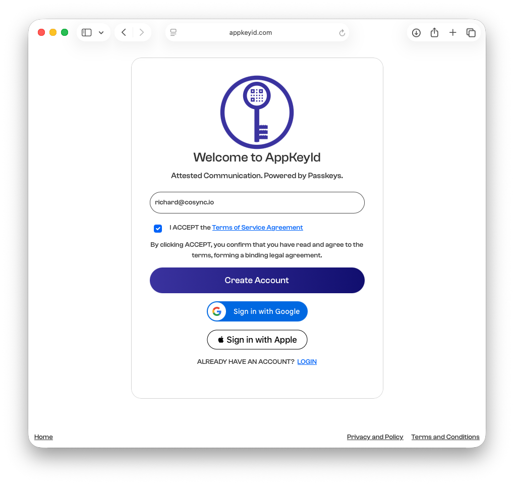
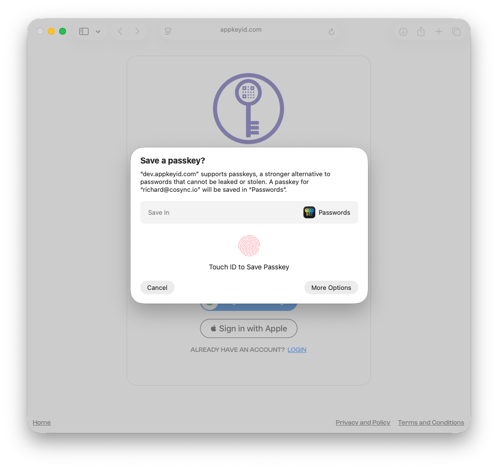
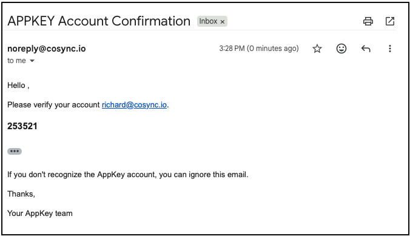
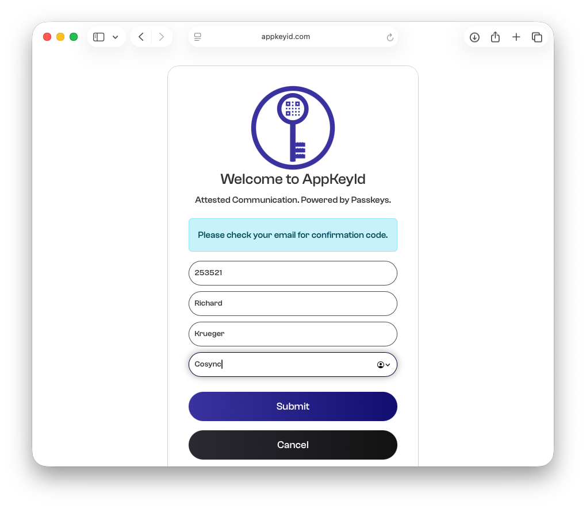
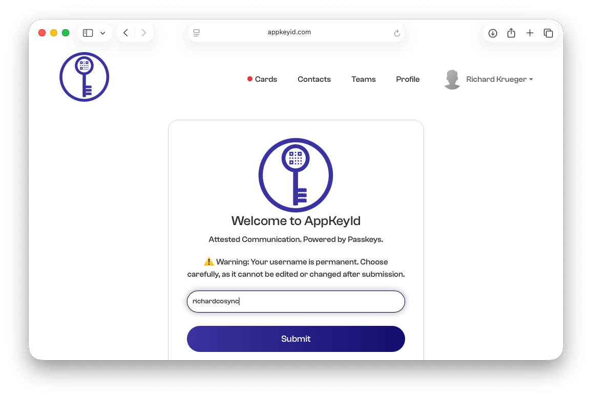

# Signing Up with Email

This tutorial walks you through the process of creating a new AppKeyId account. AppKeyId uses FIDO2 passkeys to authenticate users and protect account access with biometric verification.

## Step 1: Go to AppKeyId

Open your browser and go to:

[https://appkeyid.com](https://appkeyid.com)

You will be shown the AppKeyId signup page.

## Step 2: Enter Your Email Address

Enter the email address you want to associate with your AppKeyId account.

Each AppKeyId account has a unique email address associated with it. AppKeyId will verify that you own this email address by sending you a unique six-digit verification code.

Before creating your account, review and accept the Terms of Service agreement.

After entering your email address and accepting the Terms of Service, click the **Create Account** button.

## Step 3: Create Your AppKeyId Passkey

Next, AppKeyId will prompt you to create a passkey for the email address you entered.

On Apple devices, this passkey can be saved in your iCloud Keychain. The passkey is only accessible through biometric verification, such as a fingerprint on a desktop computer or Face ID on a mobile device.

This passkey will be used to securely authenticate you when you log in to AppKeyId.

## Step 4: Check Your Email for the Verification Code

After creating your passkey, AppKeyId will send a six-digit verification code to the email address you entered.

Open your email inbox and locate the message from AppKeyId.

## Step 5: Enter the Verification Code

Return to the AppKeyId interface and enter the six-digit verification code from your email.

You will also be prompted to enter your name and company. After completing these fields, click the **Submit** button.

## Step 6: Create Your User Name

Finally, AppKeyId will prompt you to create a unique user name.

AppKeyId does not typically share email addresses between users. Instead, users are identified by their unique user names. This helps protect user privacy.

When another user becomes a trusted contact, contact email addresses may then be shared between those trusted users.

Create your user name and continue.

## Step 7: Your Account Is Ready

Your AppKeyId account has now been created.

You are now signed in and ready to use AppKeyId.

