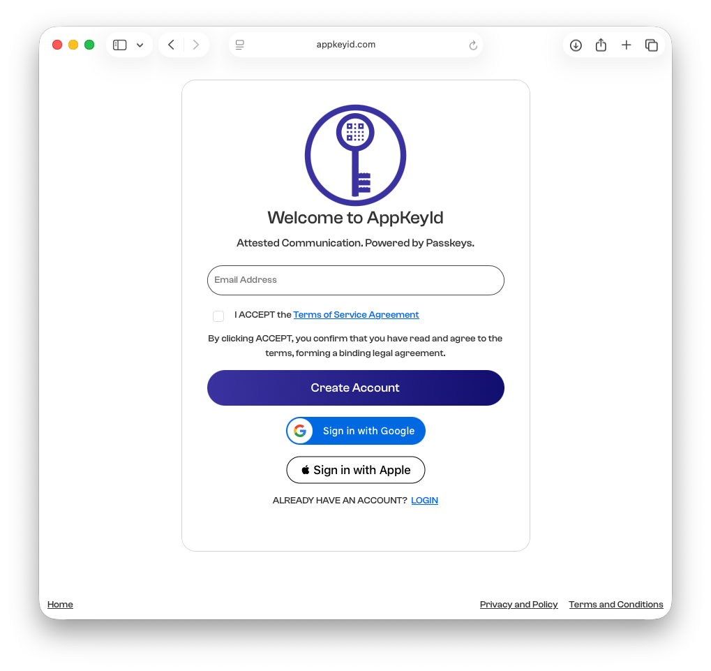
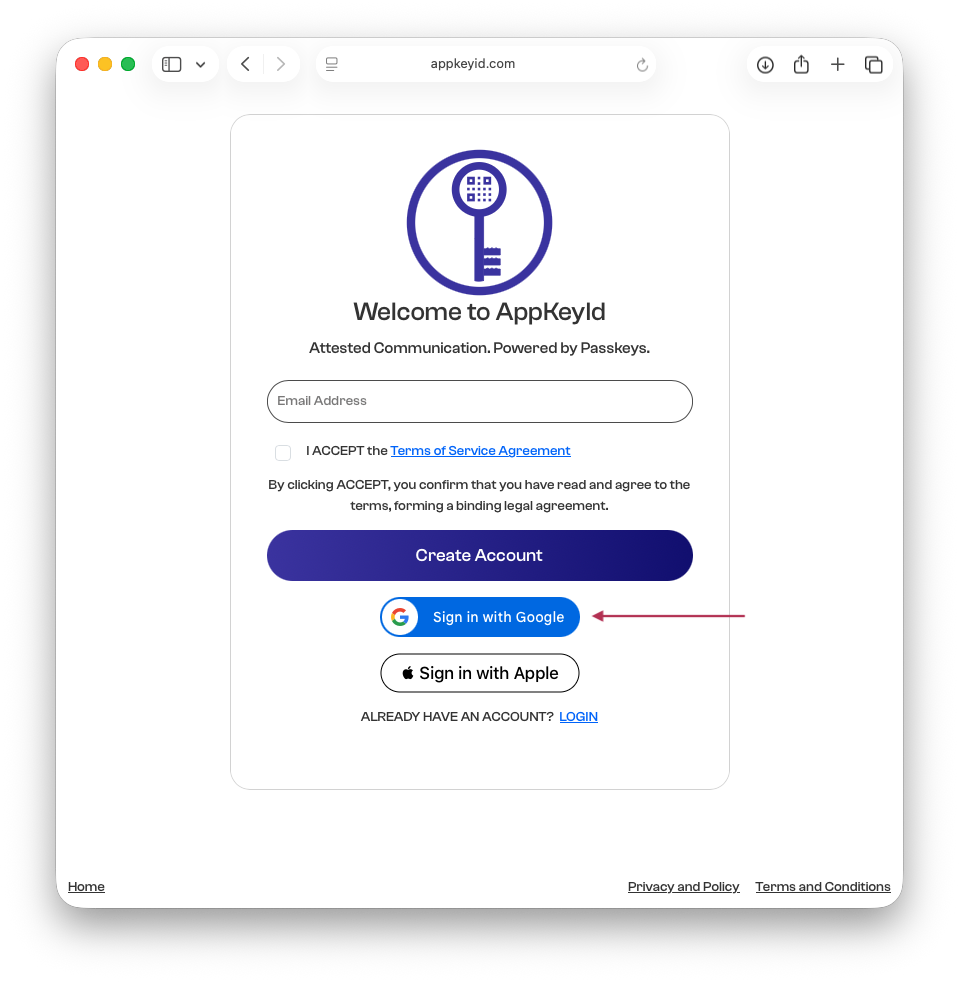
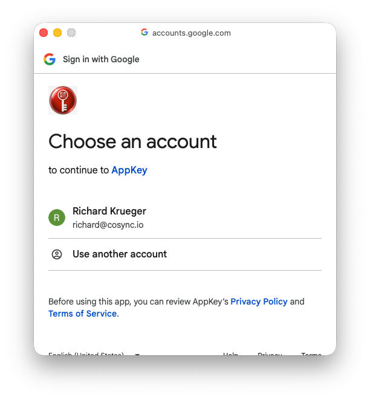
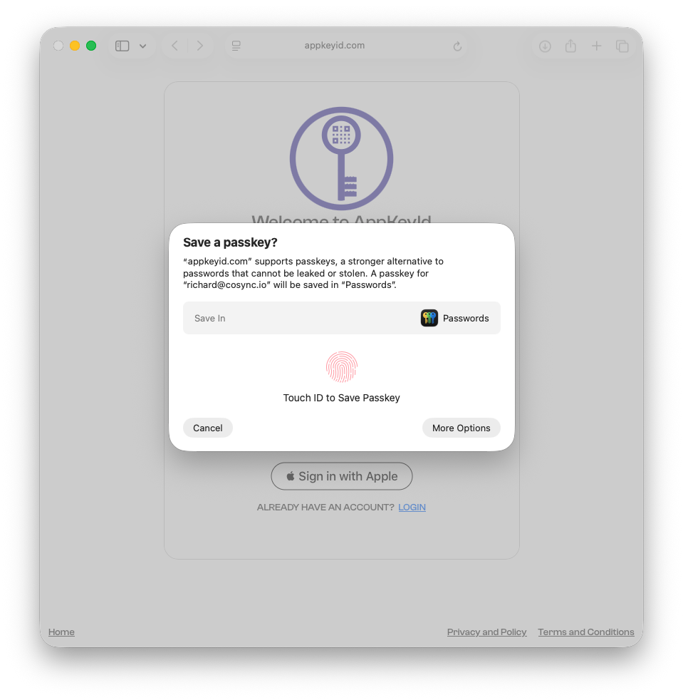
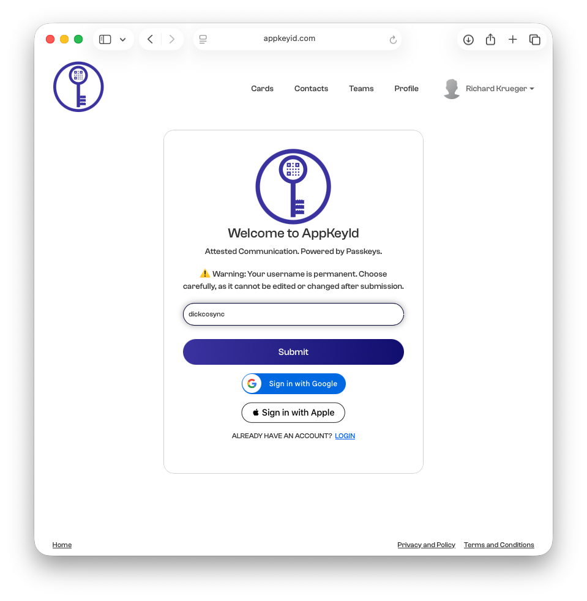
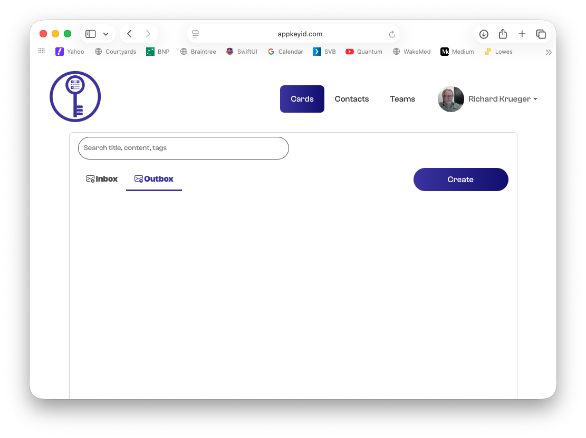

# Signing Up with Google

This tutorial walks you through the process of creating a new AppKeyId account using **Sign in with Google**.

Using Google signup allows AppKeyId to verify your email address through your Google account, so you do not need to enter a six-digit verification code manually.

## Step 1: Go to AppKeyId

Open your browser and go to:

[https://appkeyid.com](https://appkeyid.com)

You will be shown the AppKeyId signup page.

## Step 2: Select Sign in with Google

On the signup page, click the **Sign in with Google** button.

Like with email signup, each AppKeyId account has a unique email address associated with it.

When you use Google signup, you do not need to verify ownership of your email address with a six-digit code. Instead, Google validates the email account on your behalf.

## Step 3: Select Your Google Account

You will be prompted to select the Google account you want to use with AppKeyId.

Choose the Google account you want to associate with your AppKeyId account.

## Step 4: Create Your AppKeyId Passkey

Next, AppKeyId will prompt you to create a passkey for the Google email address you selected.

On Apple devices, this passkey can be saved in your iCloud Keychain. The passkey is only accessible through biometric verification, such as a fingerprint on a desktop computer or Face ID on a mobile device.

This passkey will be used to securely authenticate you when you log in to AppKeyId.

## Step 5: Confirm Your Profile Information

Another advantage of using Google signup is that you do not need to manually enter your first and last name.

AppKeyId can use the name information associated with your Google account to create your AppKeyId profile.

## Step 6: Create Your User Name

Finally, AppKeyId will prompt you to create a unique user name.

AppKeyId does not typically share email addresses between users. Instead, users are identified by their unique user names. This helps protect user privacy.

When another user becomes a trusted contact, contact email addresses may then be shared between those trusted users.

Create your user name and continue.

## Step 7: Your Account Is Ready

Your AppKeyId account has now been created.

You are now signed in and ready to use AppKeyId.

